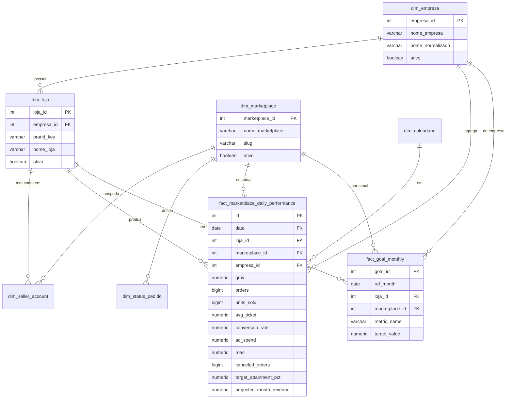

# Data Contracts — Torre de Controle GoBeauté

Versão: 1.0 | Atualizado: 2026-06-16

---

## 1. Entidades canônicas

### dim_empresa

Grupos empresariais. No momento, toda operação GoBeauté está sob uma única empresa-mãe, mas o modelo suporta expansão.

| Campo | Tipo | Obrigatório | Descrição |
|---|---|---|---|
| empresa_id | serial | ✅ | PK |
| nome_empresa | varchar(100) | ✅ | Nome de exibição |
| nome_normalizado | varchar(100) | ✅ | Slug sem acento (ex: `gobeaute`) |
| ativo | boolean | ✅ | Default true |
| created_at | timestamptz | ✅ | |
| updated_at | timestamptz | ✅ | |

**Seed inicial:**
| empresa_id | nome_empresa | nome_normalizado |
|---|---|---|
| 1 | GoBeauté | gobeaute |

---

### dim_loja

Cada brand/loja operacional. Mapeada diretamente do campo `brand` das tabelas do Data Mart.

| Campo | Tipo | Obrigatório | Descrição |
|---|---|---|---|
| loja_id | serial | ✅ | PK |
| empresa_id | int | ✅ | FK dim_empresa |
| brand_key | varchar(50) | ✅ | Chave exata usada no Data Mart (ex: `kokeshi`) |
| nome_loja | varchar(100) | ✅ | Nome de exibição (ex: `KOKESHI`) |
| nome_normalizado | varchar(100) | ✅ | Slug (ex: `kokeshi`) |
| ativo | boolean | ✅ | Default true |
| created_at | timestamptz | ✅ | |
| updated_at | timestamptz | ✅ | |

**Seed inicial (brands no escopo):**
| loja_id | empresa_id | brand_key | nome_loja | TikTok | ML |
|---|---|---|---|---|---|
| 1 | 1 | apice | ÁPICE | ✅ | ❌ |
| 2 | 1 | barbours | BARBOURS | ✅ | ✅ |
| 3 | 1 | kokeshi | KOKESHI | ✅ | ✅ |
| 4 | 1 | lescent | LESCENT | ✅ | ✅ |
| 5 | 1 | rituaria | RITUÁRIA | ✅ | ✅ (desde 2026-07-01) |

**Fora do escopo (não incluir no seed):** `azbuy`, `gocase`

---

### dim_marketplace

| Campo | Tipo | Obrigatório | Descrição |
|---|---|---|---|
| marketplace_id | serial | ✅ | PK |
| nome_marketplace | varchar(50) | ✅ | Ex: `TikTok Shop` |
| slug | varchar(20) | ✅ | Ex: `tiktok`, `mercadolivre` |
| ativo | boolean | ✅ | |

**Seed inicial:**
| marketplace_id | nome_marketplace | slug |
|---|---|---|
| 1 | TikTok Shop | tiktok |
| 2 | Mercado Livre | mercadolivre |
| 3 | Shopee | shopee |
| 4 | Magalu | magalu |
| 5 | Amazon | amazon |

Shopee (`marketplace_id = 3`) está ativa para ingestão via exports locais. Magalu e Amazon permanecem cadastrados mas inativos até integração.

---

### dim_seller_account

Conta de seller por marketplace. No TikTok, identificada por `shop_cipher`/`shop_name`. No ML, por `seller_id`.

| Campo | Tipo | Obrigatório | Descrição |
|---|---|---|---|
| seller_account_id | serial | ✅ | PK |
| marketplace_id | int | ✅ | FK dim_marketplace |
| loja_id | int | ✅ | FK dim_loja |
| external_seller_id | varchar(100) | ✅ | ID na plataforma (seller_id ML / shop_cipher TikTok) |
| account_name | varchar(200) | ❌ | Nome da conta na plataforma |
| ativo | boolean | ✅ | |
| created_at | timestamptz | ✅ | |
| updated_at | timestamptz | ✅ | |

> **Nota**: Os `shop_cipher` do TikTok serão levantados via query nos dados reais na Sprint 3.

---

### dim_calendario

Tabela gerada (sem FK para outras tabelas). Cobre 2024–2027.

| Campo | Tipo | Descrição |
|---|---|---|
| date | date | PK |
| ano | int | |
| mes | int | 1–12 |
| mes_nome | varchar(20) | Janeiro, Fevereiro... |
| mes_abrev | varchar(3) | Jan, Fev... |
| semana_iso | int | |
| trimestre | int | 1–4 |
| dia_semana | int | 1=segunda, 7=domingo |
| dia_semana_nome | varchar(15) | |
| inicio_semana | date | Segunda-feira da semana |
| inicio_mes | date | Dia 1 do mês |
| fim_mes | date | Último dia do mês |
| dias_no_mes | int | |
| is_weekend | boolean | |

---

### dim_status_pedido

| Campo | Tipo | Descrição |
|---|---|---|
| status_id | serial | PK |
| marketplace_id | int | FK dim_marketplace (null = canônico) |
| raw_status | varchar(50) | Valor original da plataforma |
| status_canonico | varchar(30) | Ver tabela de mapeamento abaixo |
| descricao | text | Descrição para exibição |

---

### fact_marketplace_daily_performance ⭐ (MVP — tabela principal)

Alimentada das gold tables do Data Mart. Granularidade: `date × loja_id × marketplace_id`.

| Campo | Tipo | Fonte TikTok | Fonte ML |
|---|---|---|---|
| id | serial | — | — |
| date | date | `tiktok_brand_daily.date` | `ml_gestao_diaria.ref_date` |
| loja_id | int | via brand_key | via brand_key |
| marketplace_id | int | 1 | 2 |
| empresa_id | int | via loja_id | via loja_id |
| gmv | numeric | `gmv` | `gmv` |
| orders | bigint | `orders` | `paid_orders` |
| units_sold | bigint | `items_sold` | `total_units` |
| avg_ticket | numeric | `avg_ticket` | `avg_ticket` |
| unique_buyers | bigint | `customers` | `unique_buyers` |
| new_buyers | bigint | null | `new_buyers` |
| repeat_buyers | bigint | null | `repeat_buyers` |
| repeat_buyer_rate_pct | numeric | null | `repeat_buyer_rate_pct` |
| visitors | bigint | `visitors` | null |
| conversion_rate | numeric | `conversion_rate` | null |
| canceled_orders | bigint | `canceled` | `cancelled_orders` |
| returned_orders | bigint | `returned` | null |
| refunded_orders | bigint | `refunded` | null |
| problem_rate | numeric | `problem_rate` | null |
| cancel_rate_pct | numeric | null | `cancel_rate_pct` |
| ad_spend | numeric | null | `ad_spend` |
| ad_revenue | numeric | null | `ad_revenue` |
| ad_impressions | bigint | null | `ad_impressions` |
| ad_clicks | bigint | null | `ad_clicks` |
| roas | numeric | null | `roas` |
| acos_pct | numeric | null | `acos_pct` |
| ctr_pct | numeric | null | `ctr_pct` |
| cpc | numeric | null | `cpc` |
| gmv_video | numeric | `gmv_video` | null |
| gmv_live | numeric | `gmv_live` | null |
| gmv_card | numeric | `gmv_card` | null |
| total_settlement | numeric | `total_settlement` | null |
| total_fees | numeric | `total_fees` | null |
| avg_fee_pct | numeric | `avg_fee_pct` | null |
| avg_settlement_pct | numeric | `avg_settlement_pct` | null |
| avg_delivery_hours | numeric | `avg_delivery_hours` | null |
| avg_delivery_days | numeric | null | `avg_delivery_days` |
| seller_shipping_cost | numeric | null | `seller_shipping_cost` |
| shipping_pct_of_gmv | numeric | null | `shipping_pct_of_gmv` |
| delivered_orders | bigint | `delivered_orders` | `delivered_shipments` |
| target_revenue | numeric | null (da fact_goal_monthly) | null |
| target_attainment_pct | numeric | 🔶 calculado | 🔶 calculado |
| projected_month_revenue | numeric | 🔶 calculado | 🔶 calculado |
| data_quality_score | numeric | 🔶 calculado | 🔶 calculado |
| source_updated_at | timestamptz | timestamp do último sync | |
| ingested_at | timestamptz | timestamp de carga | |

> Campos `null` significam "fonte não disponível", não zero. Frontend deve exibir como `—` ou `N/D`.

#### Semantica financeira de `total_settlement` / `total_fees` (documentado em 2026-07-01, ver auditoria em `docs/sections/financeiro_audit.md` secao 11)

| Canal | Sinal de `total_fees` | Tratamento na API | `total_settlement` — o que realmente e |
|---|---|---|---|
| TikTok | Negativo (debito) | `abs(total_fees)` antes de expor | Vem de `gold.tiktok_brand_daily`, que por sua vez reflete o subsistema de repasses (statements) do Data Mart. E um valor de repasse genuino. **Comprovado:** medido sobre uma base de "revenue" ~5,5% maior que o GMV comercial em mai/2026 (universos diferentes, verificado por SQL). **Inferencia forte, ainda nao comprovada pedido a pedido:** o repasse de um mes tambem pode incluir pedidos de outro mes — `raw.tiktok_shop_settlements` (que ligaria settlement a `order_id`) esta vazia nesta replica do Data Mart. Nao comparar `total_settlement / gmv` do mesmo mes como se fosse uma margem estavel — varia de 35% a 77% mes a mes. |
| Shopee | Positivo (custo) | Exposto direto, sem `abs()` | **Nao e settlement.** Vem da coluna "Total global" do export `Order.all*.xlsx` (`pipelines/connectors/shopee/_parser.py`) — e o valor total do pedido, nao um repasse liquido. Fica sempre perto de 90-100%+ do GMV independente da taxa real. Nao usar como indicador de margem/liquidez ate existir uma fonte real de repasse (relatorio de renda/income release da Shopee, hoje nao integrado). |
| ML | Sempre `NULL` | N/A | Campo nao existe no mart para ML. A comissao real do marketplace existe em `gold.ml_produto_pnl.marketplace_fee` (RDS, media ~16,5% da receita bruta) mas essa tabela e cumulativa por produto, **sem coluna de data** — nao deve ser somada a um mes especifico sem uma fonte com competencia temporal. |

---

### fact_goal_monthly

Metas mensais. Carregadas manualmente do XLSX na Sprint 7.

| Campo | Tipo | Descrição |
|---|---|---|
| goal_id | serial | PK |
| ref_month | date | Primeiro dia do mês de referência |
| loja_id | int | FK dim_loja |
| marketplace_id | int | FK dim_marketplace (null = todos) |
| empresa_id | int | FK dim_empresa |
| metric_name | varchar(50) | Ex: `gmv`, `orders`, `conversion_rate` |
| target_value | numeric | Valor da meta |
| source | varchar(50) | Ex: `xlsx_2026`, `manual` |
| created_at | timestamptz | |
| updated_at | timestamptz | |

---

### audit.source_sync_run

Registra cada execução de sync.

| Campo | Tipo | Descrição |
|---|---|---|
| sync_run_id | serial | PK |
| source_name | varchar(50) | Ex: `tiktok_brand_daily`, `ml_gestao_diaria` |
| marketplace_id | int | |
| loja_id | int | null = todas as lojas |
| started_at | timestamptz | |
| finished_at | timestamptz | |
| status | varchar(20) | `running`, `success`, `failed` |
| rows_extracted | int | |
| rows_loaded | int | |
| error_message | text | |
| source_min_date | date | Período mínimo extraído |
| source_max_date | date | Período máximo extraído |

---

## 2. Mapeamento de status canônico

### TikTok Shop → Canônico

| raw_status (TikTok) | status_canonico | Descrição | Volume real |
|---|---|---|---|
| COMPLETED | delivered | Pedido entregue e finalizado | 1.141.634 |
| CANCELLED | cancelled | Pedido cancelado | 331.201 |
| DELIVERED | delivered | Entregue (ainda não fechado) | 202.991 |
| UNPAID | pending | Aguardando pagamento | 86.764 |
| IN_TRANSIT | shipped | Em trânsito para entrega | 76.672 |
| AWAITING_COLLECTION | shipped | Aguardando coleta pela transportadora | 57.112 |
| AWAITING_SHIPMENT | processing | Pago, aguardando envio pelo seller | 1.584 |
| ON_HOLD | on_hold | Pedido retido (fraude/revisão) | 115 |

### Mercado Livre → Canônico

| raw_status (ML) | status_canonico | Descrição | Volume real |
|---|---|---|---|
| paid | paid | Pago e ativo | 207.884 |
| cancelled | cancelled | Cancelado | 11.540 |
| partially_refunded | returned | Reembolsado parcialmente | 142 |
| pending_cancel | cancelled | Cancelamento pendente de confirmação | 4 |

### Status canônicos completos

| status_canonico | Descrição | TikTok | ML |
|---|---|---|---|
| pending | Aguardando pagamento | ✅ | ❌ |
| paid | Pago, processando | ❌ | ✅ |
| processing | Pago, preparando envio | ✅ | ❌ |
| shipped | Em trânsito | ✅ | ❌ |
| delivered | Entregue | ✅ | ❌ (inferido via shipments) |
| cancelled | Cancelado | ✅ | ✅ |
| returned | Devolvido / reembolsado | ✅ | ✅ |
| on_hold | Retido | ✅ | ❌ |
| unknown | Status não mapeado | fallback | fallback |

---

## 3. Disponibilidade de métricas por marketplace

| Métrica | TikTok | ML | Shopee |
|---|---|---|---|
| GMV diário | ✅ | ✅ | ✅ exports orders |
| Pedidos | ✅ | ✅ | ✅ exports orders |
| Unidades vendidas | ✅ | ✅ | ✅ exports orders |
| Ticket médio | ✅ | ✅ | 🔶 calculado |
| Visitantes | ✅ | ❌ | ✅ shop-stats |
| Taxa de conversão | ✅ | ❌ | ✅ shop-stats |
| Novos compradores | ❌ | ✅ | ✅ shop-stats |
| Taxa de recompra | ❌ | ✅ | ❌ |
| Cancelamentos | ✅ | ✅ | ❌ |
| Devoluções | ✅ | ❌ | ❌ |
| Tempo de entrega | ✅ (horas) | ✅ (dias) | ❌ |
| Investimento mídia | ❓ (investigar) | ✅ | ✅ ads CSV, média diária |
| ROAS | ❓ (investigar) | ✅ | 🔶 ads CSV |
| ACOS | ❌ (investigar) | ✅ | ❌ |
| GMV por vídeo/live | ✅ | ❌ | ❌ |
| Taxas marketplace | ✅ | ❌ (investigar) | ❌ |
| Valor liquidado | ✅ | ❌ | ❌ |
| Ranking SKU | ✅ | ✅ | ❌ |
| Estoque | ❌ | ✅ (ml_item_stock) | ❌ |
| Metas mensais | ❌ (XLSX) | ❌ (XLSX) | ❌ |

---

## 4. ERD simplificado (Mermaid)

---

## 5. Regras de qualidade obrigatórias

1. **GMV nunca negativo**: `gmv >= 0` ou null.
2. **Data válida**: `date >= '2025-01-01'` e `date <= CURRENT_DATE + 1`.
3. **Brand no escopo**: apenas `apice`, `barbours`, `kokeshi`, `lescent`, `rituaria`.
4. **Sem duplicidade**: `UNIQUE(date, loja_id, marketplace_id)` em `fact_marketplace_daily_performance`.
5. **Null explícito**: métrica indisponível = `null`, nunca `0` para evitar distorção de médias.
6. **Fonte rastreável**: toda linha tem `source_updated_at` e `ingested_at`.

---

## 6. Campos obrigatórios vs opcionais por entidade

### fact_marketplace_daily_performance
**Obrigatórios** (não podem ser null): `date`, `loja_id`, `marketplace_id`, `empresa_id`, `ingested_at`
**Obrigatórios por marketplace**:
- TikTok: `gmv`, `orders`, `units_sold`, `avg_ticket`
- ML: `gmv`, `paid_orders`, `total_units`, `avg_ticket`

**Opcionais** (podem ser null sem invalidar o registro): todos os demais campos, especialmente métricas de mídia e conteúdo.

### Shopee — contrato atual via exports

A integração Shopee usa arquivos locais em `SHOPEE_DATA_PATH`, com subpasta por brand. O destino canônico é `marts.fact_marketplace_daily_performance` na granularidade `date × loja_id × marketplace_id`.

Fontes:
- `Order.all*.xlsx`: GMV, pedidos, unidades, compradores, cancelamentos, devoluções, liquidação, taxas e frete seller.
- `*.shopee-shop-stats.*.xlsx`: visitantes, conversão, novos compradores e recompra.
- `Dados*.csv`: mídia paga; como o export é agregado por período, o pipeline distribui totais como média diária.

Caveat: a Shopee ainda não tem API conectada; a fonte de verdade operacional nesta fase são os exports do Seller Center.

#### Contrato do parser numérico (`pipelines/connectors/shopee/_numeric.py::parse_brl_float`, 2026-07-04, endurecido em 2026-07-04)

Usado por `_parser.py` (orders: `Quantidade`, `Subtotal do produto`, `Total global`, `Taxa de comissão líquida`, `Taxa de serviço líquida`, `Valor estimado do frete`) e por `_parser_ads.py` (ads: `Impressões`, `Cliques`, `Despesas`, `GMV`). Não é usado pelos parsers de shop-stats (`_parse_int`/`_parse_pct` em `_parser_shop_stats.py` são funções separadas, corretas para os formatos encontrados — inteiros puros e percentuais com vírgula decimal sempre < 100).

- **Formato confirmado em 100% das fontes reais** (85 arquivos `Order.all*.xlsx` / 383.298 linhas, 10 CSVs de ads / 804 registros, auditados linha a linha em 2026-07-04): decimal com **ponto**, sem separador de milhar (ex.: `"1546.30"`, `"38147.83"`). Nenhuma vírgula decimal, nenhum prefixo `R$`, nenhum NBSP, nenhum negativo, nenhum vazio/`-`/`N/A` foi encontrado nessas colunas.
- **Aceita também** (proteção para exports futuros, não exercitada pelos dados atuais): vírgula decimal BR (`"1234,56"`), BR com separador de milhar (`"1.234,56"`), prefixo `"R$"`, espaços/NBSP, negativos.
- **Vazio/ausente** (`None`, `""`, `"-"`, `"N/A"/"NA"/"NULL"/"NONE"`) → `None` (sem valor). Os chamadores tratam `None` como contribuição zero na agregação — distinto de um valor inválido.
- **Valor não vazio e inválido, ou não finito (NaN/±Infinity) → fail-fast, nunca `0.0`.** `parse_brl_float` levanta `ShopeeNumericParseError` sem incluir o valor bruto da célula na mensagem (nunca `repr(val)` nem o conteúdo original — só uma descrição genérica). `_parser.py`/`_parser_ads.py` **relançam** a exceção com contexto sanitizado (marca, nome do arquivo, número da linha/índice do anúncio, nome do campo — nunca buyer, endereço, CPF, `order_id` ou o valor bruto) e a deixam **propagar**, interrompendo a leitura daquela fonte com exit code != 0. O orquestrador (`pipelines/ops/orchestrate.py`) já marca o step como `FAILED` e segue com as fontes independentes seguintes — nenhuma métrica financeira construída sobre um valor não interpretável é publicada com status de sucesso.
- **Formato US** (`"1,234.56"`, vírgula de milhar + ponto decimal) → **rejeitado explicitamente** (`ShopeeNumericParseError`), nunca convertido silenciosamente para um valor errado. A decisão é posicional: se o último `,` vem depois do último `.` (`"1.234,56"`), é BR e é aceito; se o último `,` vem antes do último `.` (`"1,234.56"`), é padrão US ou ambíguo e é rejeitado. Não há nenhuma evidência desse formato em nenhuma das 3 fontes auditadas — rejeitar explicitamente foi escolhido em vez de suportar por não haver nenhum caso real a atender.
- **Diagnóstico da Raw** (`load_shopee_raw.py::_reconcile_source`, usado só por `--dry-run`, nunca pela carga real): uma célula numérica inválida é contada em `numeric_parse_errors` e nunca é excluída silenciosamente da soma — se o total for maior que zero, `_print_dry_run_report` reprova a reconciliação (`SystemExit(1)`, nunca imprime "Reconciliação OK" ignorando o erro).

**Causa raiz do bug histórico (corrigido, impacto zero confirmado):** a implementação anterior (`_parse_float`, uma em `_parser.py` e outra divergente em `_parser_ads.py`) fazia apenas `replace(",", ".")`, sem remover separador de milhar — `"1.234,56"` virava `"1.234.56"`, `ValueError`, e o valor virava `0.0` silenciosamente, sem log. O runbook (`docs/runbook_shopee_raw.md`) documentava isso como suspeita não verificada. **Auditoria independente de 2026-07-04 comparou o parser antigo com o novo linha a linha nas 383.298 linhas de orders e 804 registros de ads (100% dos dados, não amostra): zero divergências, somas idênticas ao centavo em todas as colunas.** O bug era real no código, mas nunca foi exercitado pelos exports reais — nenhuma linha histórica foi afetada. Ver `docs/runbook_shopee_raw.md` seção 11 para o detalhamento completo e o plano de remediação (não aplicável, pois não há dado a corrigir).

---

## 7. Raw Shopee (Fase Raw Shopee — 2026-07-03, aplicado e carregado)

Contrato para 4 tabelas em `raw.*` no **Data Mart** (não no Neon, não no Postgres local) — DDL em `db/sql/raw/shopee_raw_ddl.sql`, **executado**, com backfill completo (384.882 linhas, 120 arquivos, reconciliação sem problemas). Ver `docs/runbook_shopee_raw.md` para o runbook completo.

Diferença de propósito em relação a `fact_marketplace_daily_performance` (seção 1 acima): aquela tabela é o **agregado diário** consumido pelo dashboard; as tabelas abaixo são o **espelho append-only da linha física exportada pela Shopee**, sem nenhuma agregação, filtro por status ou dedup — pensadas para auditoria/reprocessamento futuro, não para consumo direto do frontend.

### raw.shopee_ingestion_file
Grão: um arquivo físico (+ sheet) ingerido. Idempotência técnica via `UNIQUE(file_sha256, sheet_name)`.

### raw.shopee_order_item_export
Grão: uma linha física de SKU de um export `Order.all*.xlsx`, em um arquivo/snapshot específico. `raw_payload JSONB` guarda todas as colunas originais por nome exato da Shopee. **Contém PII direta** (nome do destinatário, telefone, endereço, CEP; CPF apenas no template da marca apice) — carga integral com PII autorizada explicitamente pelo usuário em 2026-07-03 (ver runbook seção 5); nenhum HMAC/mascaramento foi aplicado. Pedidos cancelados e exports sobrepostos **não são filtrados nem deduplicados** aqui — isso é responsabilidade de uma staging futura, fora do escopo desta fase.

### raw.shopee_shop_stats_export
Grão: uma linha física do relatório shop-stats (a linha de total do período OU uma linha diária). Sem PII.

### raw.shopee_ads_export
Grão: uma linha física por anúncio no CSV de ads. Sem PII. Mantém a limitação de granularidade agregada por período (sem distribuição diária) na própria raw — a distribuição fica para staging/gold, como já ocorre hoje.

### Regras de qualidade específicas desta camada

1. **Nunca deduplicar** por `order_id`/data entre arquivos — grão é por linha física de arquivo, não por evento de negócio.
2. **Nunca** usar `DATAMART_DATABASE_URL` para escrever nestas tabelas — Gate 2 exige uma credencial dedicada (`DATAMART_SHOPEE_WRITE_URL`), distinta da de leitura.
3. `raw_payload` é a fonte da verdade dos valores originais; qualquer campo técnico (file_id, source_row_number, hashes, timestamps) fica **fora** do payload.
