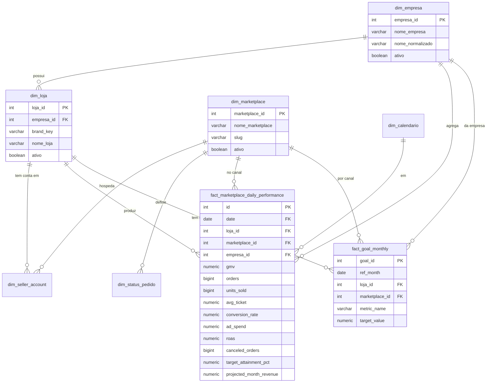

# Data Contracts — Torre de Controle GoBeauté

Versão: 1.0 | Atualizado: 2026-06-16

---

## 1. Entidades canônicas

### dim_empresa

Grupos empresariais. No momento, toda operação GoBeauté está sob uma única empresa-mãe, mas o modelo suporta expansão.

| Campo | Tipo | Obrigatório | Descrição |
|---|---|---|---|
| empresa_id | serial | ✅ | PK |
| nome_empresa | varchar(100) | ✅ | Nome de exibição |
| nome_normalizado | varchar(100) | ✅ | Slug sem acento (ex: `gobeaute`) |
| ativo | boolean | ✅ | Default true |
| created_at | timestamptz | ✅ | |
| updated_at | timestamptz | ✅ | |

**Seed inicial:**
| empresa_id | nome_empresa | nome_normalizado |
|---|---|---|
| 1 | GoBeauté | gobeaute |

---

### dim_loja

Cada brand/loja operacional. Mapeada diretamente do campo `brand` das tabelas do Data Mart.

| Campo | Tipo | Obrigatório | Descrição |
|---|---|---|---|
| loja_id | serial | ✅ | PK |
| empresa_id | int | ✅ | FK dim_empresa |
| brand_key | varchar(50) | ✅ | Chave exata usada no Data Mart (ex: `kokeshi`) |
| nome_loja | varchar(100) | ✅ | Nome de exibição (ex: `KOKESHI`) |
| nome_normalizado | varchar(100) | ✅ | Slug (ex: `kokeshi`) |
| ativo | boolean | ✅ | Default true |
| created_at | timestamptz | ✅ | |
| updated_at | timestamptz | ✅ | |

**Seed inicial (brands no escopo):**
| loja_id | empresa_id | brand_key | nome_loja | TikTok | ML |
|---|---|---|---|---|---|
| 1 | 1 | apice | ÁPICE | ✅ | ❌ |
| 2 | 1 | barbours | BARBOURS | ✅ | ✅ |
| 3 | 1 | kokeshi | KOKESHI | ✅ | ✅ |
| 4 | 1 | lescent | LESCENT | ✅ | ✅ |
| 5 | 1 | rituaria | RITUÁRIA | ✅ | ✅ (desde 2026-07-01) |

**Fora do escopo (não incluir no seed):** `azbuy`, `gocase`

---

### dim_marketplace

| Campo | Tipo | Obrigatório | Descrição |
|---|---|---|---|
| marketplace_id | serial | ✅ | PK |
| nome_marketplace | varchar(50) | ✅ | Ex: `TikTok Shop` |
| slug | varchar(20) | ✅ | Ex: `tiktok`, `mercadolivre` |
| ativo | boolean | ✅ | |

**Seed inicial:**
| marketplace_id | nome_marketplace | slug |
|---|---|---|
| 1 | TikTok Shop | tiktok |
| 2 | Mercado Livre | mercadolivre |
| 3 | Shopee | shopee |
| 4 | Magalu | magalu |
| 5 | Amazon | amazon |

Shopee (`marketplace_id = 3`) está ativa para ingestão via exports locais. Magalu e Amazon permanecem cadastrados mas inativos até integração.

---

### dim_seller_account

Conta de seller por marketplace. No TikTok, identificada por `shop_cipher`/`shop_name`. No ML, por `seller_id`.

| Campo | Tipo | Obrigatório | Descrição |
|---|---|---|---|
| seller_account_id | serial | ✅ | PK |
| marketplace_id | int | ✅ | FK dim_marketplace |
| loja_id | int | ✅ | FK dim_loja |
| external_seller_id | varchar(100) | ✅ | ID na plataforma (seller_id ML / shop_cipher TikTok) |
| account_name | varchar(200) | ❌ | Nome da conta na plataforma |
| ativo | boolean | ✅ | |
| created_at | timestamptz | ✅ | |
| updated_at | timestamptz | ✅ | |

> **Nota**: Os `shop_cipher` do TikTok serão levantados via query nos dados reais na Sprint 3.

---

### dim_calendario

Tabela gerada (sem FK para outras tabelas). Cobre 2024–2027.

| Campo | Tipo | Descrição |
|---|---|---|
| date | date | PK |
| ano | int | |
| mes | int | 1–12 |
| mes_nome | varchar(20) | Janeiro, Fevereiro... |
| mes_abrev | varchar(3) | Jan, Fev... |
| semana_iso | int | |
| trimestre | int | 1–4 |
| dia_semana | int | 1=segunda, 7=domingo |
| dia_semana_nome | varchar(15) | |
| inicio_semana | date | Segunda-feira da semana |
| inicio_mes | date | Dia 1 do mês |
| fim_mes | date | Último dia do mês |
| dias_no_mes | int | |
| is_weekend | boolean | |

---

### dim_status_pedido

| Campo | Tipo | Descrição |
|---|---|---|
| status_id | serial | PK |
| marketplace_id | int | FK dim_marketplace (null = canônico) |
| raw_status | varchar(50) | Valor original da plataforma |
| status_canonico | varchar(30) | Ver tabela de mapeamento abaixo |
| descricao | text | Descrição para exibição |

---

### fact_marketplace_daily_performance ⭐ (MVP — tabela principal)

Alimentada das gold tables do Data Mart. Granularidade: `date × loja_id × marketplace_id`.

| Campo | Tipo | Fonte TikTok | Fonte ML |
|---|---|---|---|
| id | serial | — | — |
| date | date | `tiktok_brand_daily.date` | `ml_gestao_diaria.ref_date` |
| loja_id | int | via brand_key | via brand_key |
| marketplace_id | int | 1 | 2 |
| empresa_id | int | via loja_id | via loja_id |
| gmv | numeric | `gmv` | `gmv` |
| orders | bigint | `orders` | `paid_orders` |
| units_sold | bigint | `items_sold` | `total_units` |
| avg_ticket | numeric | `avg_ticket` | `avg_ticket` |
| unique_buyers | bigint | `customers` | `unique_buyers` |
| new_buyers | bigint | null | `new_buyers` |
| repeat_buyers | bigint | null | `repeat_buyers` |
| repeat_buyer_rate_pct | numeric | null | `repeat_buyer_rate_pct` |
| visitors | bigint | `visitors` | null |
| conversion_rate | numeric | `conversion_rate` | null |
| canceled_orders | bigint | **contagem Raw deduplicada de `CANCELLED`** (Gate DQ-TK1; NÃO da Gold) | `cancelled_orders` |
| returned_orders | bigint | **NULL** — nenhum status de devolução existe na Raw | null |
| refunded_orders | bigint | **NULL** — nenhum status de reembolso existe na Raw | null |
| problem_rate | numeric | **NULL** — depende de devolução/reembolso, que não têm fonte | null |
| cancel_rate_pct | numeric | **derivado**: `canceled / (comercial + canceled) × 100`, 2 casas, NULL se denominador = 0 | `cancel_rate_pct` |
| ad_spend | numeric | null | `ad_spend` |
| ad_revenue | numeric | null | `ad_revenue` |
| ad_impressions | bigint | null | `ad_impressions` |
| ad_clicks | bigint | null | `ad_clicks` |
| roas | numeric | null | `roas` |
| acos_pct | numeric | null | `acos_pct` |
| ctr_pct | numeric | null | `ctr_pct` |
| cpc | numeric | null | `cpc` |
| gmv_video | numeric | `gmv_video` | null |
| gmv_live | numeric | `gmv_live` | null |
| gmv_card | numeric | `gmv_card` | null |
| total_settlement | numeric | `total_settlement` | null |
| total_fees | numeric | `total_fees` | null |
| avg_fee_pct | numeric | `avg_fee_pct` | null |
| avg_settlement_pct | numeric | `avg_settlement_pct` | null |
| avg_delivery_hours | numeric | `avg_delivery_hours` | null |
| avg_delivery_days | numeric | null | `avg_delivery_days` |
| seller_shipping_cost | numeric | null | `seller_shipping_cost` |
| shipping_pct_of_gmv | numeric | null | `shipping_pct_of_gmv` |
| delivered_orders | bigint | `delivered_orders` | `delivered_shipments` |
| target_revenue | numeric | null (da fact_goal_monthly) | null |
| target_attainment_pct | numeric | 🔶 calculado | 🔶 calculado |
| projected_month_revenue | numeric | 🔶 calculado | 🔶 calculado |
| data_quality_score | numeric | 🔶 calculado | 🔶 calculado |
| source_updated_at | timestamptz | timestamp do último sync | |
| ingested_at | timestamptz | timestamp de carga | |

> Campos `null` significam "fonte não disponível", não zero. Frontend deve exibir como `—` ou `N/D`.

#### Semantica financeira de `total_settlement` / `total_fees` (documentado em 2026-07-01, ver auditoria em `docs/sections/financeiro_audit.md` secao 11)

| Canal | Sinal de `total_fees` | Tratamento na API | `total_settlement` — o que realmente e |
|---|---|---|---|
| TikTok | Negativo (debito) | `abs(total_fees)` antes de expor | Vem de `gold.tiktok_brand_daily`, que por sua vez reflete o subsistema de repasses (statements) do Data Mart. E um valor de repasse genuino. **Comprovado:** medido sobre uma base de "revenue" ~5,5% maior que o GMV comercial em mai/2026 (universos diferentes, verificado por SQL). **Inferencia forte, ainda nao comprovada pedido a pedido:** o repasse de um mes tambem pode incluir pedidos de outro mes — `raw.tiktok_shop_settlements` (que ligaria settlement a `order_id`) esta vazia nesta replica do Data Mart. Nao comparar `total_settlement / gmv` do mesmo mes como se fosse uma margem estavel — varia de 35% a 77% mes a mes. |
| Shopee | Positivo (custo) | Exposto direto, sem `abs()` | **Nao e settlement.** Vem da coluna "Total global" do export `Order.all*.xlsx` (`pipelines/connectors/shopee/_parser.py`) — e o valor total do pedido, nao um repasse liquido. Fica sempre perto de 90-100%+ do GMV independente da taxa real. Nao usar como indicador de margem/liquidez ate existir uma fonte real de repasse (relatorio de renda/income release da Shopee, hoje nao integrado). |
| ML | Sempre `NULL` | N/A | Campo nao existe no mart para ML. A comissao real do marketplace existe em `gold.ml_produto_pnl.marketplace_fee` (RDS, media ~16,5% da receita bruta) mas essa tabela e cumulativa por produto, **sem coluna de data** — nao deve ser somada a um mes especifico sem uma fonte com competencia temporal. |

---

### fact_goal_monthly

Metas mensais. Carregadas manualmente do XLSX na Sprint 7.

| Campo | Tipo | Descrição |
|---|---|---|
| goal_id | serial | PK |
| ref_month | date | Primeiro dia do mês de referência |
| loja_id | int | FK dim_loja |
| marketplace_id | int | FK dim_marketplace (null = todos) |
| empresa_id | int | FK dim_empresa |
| metric_name | varchar(50) | Ex: `gmv`, `orders`, `conversion_rate` |
| target_value | numeric | Valor da meta |
| source | varchar(50) | Ex: `xlsx_2026`, `manual` |
| created_at | timestamptz | |
| updated_at | timestamptz | |

---

### audit.source_sync_run

Registra cada execução de sync.

| Campo | Tipo | Descrição |
|---|---|---|
| sync_run_id | serial | PK |
| source_name | varchar(50) | Ex: `tiktok_brand_daily`, `ml_gestao_diaria` |
| marketplace_id | int | |
| loja_id | int | null = todas as lojas |
| started_at | timestamptz | |
| finished_at | timestamptz | |
| status | varchar(20) | `running`, `success`, `failed` |
| rows_extracted | int | |
| rows_loaded | int | |
| error_message | text | |
| source_min_date | date | Período mínimo extraído |
| source_max_date | date | Período máximo extraído |

---

## 2. Mapeamento de status canônico

### TikTok Shop → Canônico

| raw_status (TikTok) | status_canonico | Descrição | Volume real | População comercial (Gate DQ-TK1) |
|---|---|---|---|---|
| COMPLETED | delivered | Pedido entregue e finalizado | 1.141.634 | ✅ entra no GMV |
| CANCELLED | cancelled | Pedido cancelado | 331.201 | ⌠venda desfeita |
| DELIVERED | delivered | Entregue (ainda não fechado) | 202.991 | ✅ entra no GMV |
| UNPAID | pending | Aguardando pagamento | 86.764 | ⌠0% com `paid_at` |
| IN_TRANSIT | shipped | Em trânsito para entrega | 76.672 | ✅ entra no GMV |
| AWAITING_COLLECTION | shipped | Aguardando coleta pela transportadora | 57.112 | ✅ 100% com `paid_at` |
| AWAITING_SHIPMENT | processing | Pago, aguardando envio pelo seller | 1.584 | ✅ 100% com `paid_at` |
| ON_HOLD | on_hold | Pedido retido (fraude/revisão) | 115 | ⌠decisão de negócio (o dado mostra 100% pago) |

> **Gate DQ-TK1 (2026-08-25)** — a coluna "População comercial" é o contrato de
> `COMMERCIAL_ORDER_STATUSES` em `pipelines/connectors/tiktok/connector.py`. Os
> oito status acima são os únicos conhecidos: **um status novo, ou nulo, bloqueia
> a carga** em `fetch()` antes de qualquer upsert, para nunca mais produzir GMV
> silenciosamente incompleto. Foi assim que `AWAITING_COLLECTION` (3.876 pedidos,
> R$ 187.962,33 só em agosto/2026) ficou fora do GMV entre o Gate R2 e este.
> Definição completa do headline em `kpi_dictionary.md` §"TikTok — GMV comercial".

### Mercado Livre → Canônico

| raw_status (ML) | status_canonico | Descrição | Volume real |
|---|---|---|---|
| paid | paid | Pago e ativo | 207.884 |
| cancelled | cancelled | Cancelado | 11.540 |
| partially_refunded | returned | Reembolsado parcialmente | 142 |
| pending_cancel | cancelled | Cancelamento pendente de confirmação | 4 |

### Status canônicos completos

| status_canonico | Descrição | TikTok | ML |
|---|---|---|---|
| pending | Aguardando pagamento | ✅ | ❌ |
| paid | Pago, processando | ❌ | ✅ |
| processing | Pago, preparando envio | ✅ | ❌ |
| shipped | Em trânsito | ✅ | ❌ |
| delivered | Entregue | ✅ | ❌ (inferido via shipments) |
| cancelled | Cancelado | ✅ | ✅ |
| returned | Devolvido / reembolsado | ✅ | ✅ |
| on_hold | Retido | ✅ | ❌ |
| unknown | Status não mapeado | fallback | fallback |

---

## 3. Disponibilidade de métricas por marketplace

| Métrica | TikTok | ML | Shopee |
|---|---|---|---|
| GMV diário | ✅ | ✅ | ✅ exports orders |
| Pedidos | ✅ | ✅ | ✅ exports orders |
| Unidades vendidas | ✅ | ✅ | ✅ exports orders |
| Ticket médio | ✅ | ✅ | 🔶 calculado |
| Visitantes | ✅ | ❌ | ✅ shop-stats |
| Taxa de conversão | ✅ | ❌ | ✅ shop-stats |
| Novos compradores | ❌ | ✅ | ✅ shop-stats |
| Taxa de recompra | ❌ | ✅ | ❌ |
| Cancelamentos | ✅ **pela Raw** (COUNT de CANCELLED deduplicado; a Gold gravava 0 falso) | ✅ | ❌ |
| Devoluções / reembolsos | ❌ **indisponivel => NULL** (nenhum status de devolucao/reembolso na Raw) | ❌ | ❌ |
| Tempo de entrega | ✅ (horas) | ✅ (dias) | ❌ |
| Investimento mídia | ❓ (investigar) | ✅ | ✅ ads CSV, média diária |
| ROAS | ❓ (investigar) | ✅ | 🔶 ads CSV |
| ACOS | ❌ (investigar) | ✅ | ❌ |
| GMV por vídeo/live | ✅ | ❌ | ❌ |
| Taxas marketplace | ✅ | ❌ (investigar) | ❌ |
| Valor liquidado | ✅ | ❌ | ❌ |
| Ranking SKU | ✅ | ✅ | ❌ |
| Estoque | ❌ | ✅ (ml_item_stock) | ❌ |
| Metas mensais | ❌ (XLSX) | ❌ (XLSX) | ❌ |

---

## 4. ERD simplificado (Mermaid)

```mermaid
erDiagram
    dim_empresa ||--o{ dim_loja : "possui"
    dim_loja ||--o{ dim_seller_account : "tem conta em"
    dim_marketplace ||--o{ dim_seller_account : "hospeda"
    dim_marketplace ||--o{ dim_status_pedido : "define"

    dim_loja ||--o{ fact_marketplace_daily_performance : "produz"
    dim_marketplace ||--o{ fact_marketplace_daily_performance : "no canal"
    dim_empresa ||--o{ fact_marketplace_daily_performance : "agrega"
    dim_calendario ||--o{ fact_marketplace_daily_performance : "em"

    dim_loja ||--o{ fact_goal_monthly : "tem meta"
    dim_marketplace ||--o{ fact_goal_monthly : "por canal"
    dim_empresa ||--o{ fact_goal_monthly : "da empresa"

    dim_empresa {
        int empresa_id PK
        varchar nome_empresa
        varchar nome_normalizado
        boolean ativo
    }

    dim_loja {
        int loja_id PK
        int empresa_id FK
        varchar brand_key
        varchar nome_loja
        boolean ativo
    }

    dim_marketplace {
        int marketplace_id PK
        varchar nome_marketplace
        varchar slug
        boolean ativo
    }

    fact_marketplace_daily_performance {
        int id PK
        date date FK
        int loja_id FK
        int marketplace_id FK
        int empresa_id FK
        numeric gmv
        bigint orders
        bigint units_sold
        numeric avg_ticket
        numeric conversion_rate
        numeric ad_spend
        numeric roas
        bigint canceled_orders
        numeric target_attainment_pct
        numeric projected_month_revenue
    }

    fact_goal_monthly {
        int goal_id PK
        date ref_month
        int loja_id FK
        int marketplace_id FK
        varchar metric_name
        numeric target_value
    }
```

---

## 5. Regras de qualidade obrigatórias

1. **GMV nunca negativo**: `gmv >= 0` ou null.
2. **Data válida**: `date >= '2025-01-01'` e `date <= CURRENT_DATE + 1`.
3. **Brand no escopo**: apenas `apice`, `barbours`, `kokeshi`, `lescent`, `rituaria`.
4. **Sem duplicidade**: `UNIQUE(date, loja_id, marketplace_id)` em `fact_marketplace_daily_performance`.
5. **Null explícito**: métrica indisponível = `null`, nunca `0` para evitar distorção de médias.
6. **Fonte rastreável**: toda linha tem `source_updated_at` e `ingested_at`.

---

## 6. Campos obrigatórios vs opcionais por entidade

### fact_marketplace_daily_performance
**Obrigatórios** (não podem ser null): `date`, `loja_id`, `marketplace_id`, `empresa_id`, `ingested_at`
**Obrigatórios por marketplace**:
- TikTok: `gmv`, `orders`, `units_sold`, `avg_ticket`
- ML: `gmv`, `paid_orders`, `total_units`, `avg_ticket`

**Opcionais** (podem ser null sem invalidar o registro): todos os demais campos, especialmente métricas de mídia e conteúdo.

### Shopee — contrato atual via exports

A integração Shopee usa arquivos locais em `SHOPEE_DATA_PATH`, com subpasta por brand. O destino canônico é `marts.fact_marketplace_daily_performance` na granularidade `date × loja_id × marketplace_id`.

Fontes:
- `Order.all*.xlsx`: GMV, pedidos, unidades, compradores, cancelamentos, devoluções, liquidação, taxas e frete seller.
- `*.shopee-shop-stats.*.xlsx`: visitantes, conversão, novos compradores e recompra.
- `Dados*.csv`: mídia paga; como o export é agregado por período, o pipeline distribui totais como média diária.

Caveat: a Shopee ainda não tem API conectada; a fonte de verdade operacional nesta fase são os exports do Seller Center.

#### Propriedade de colunas no Daily: cada fonte Shopee escreve só o que é seu (Gate SD2-C, 2026-08-17)

As três fontes Shopee gravam na **mesma linha** `date × loja_id × marketplace_id`, em execuções separadas. Cada uma usa um SQL de upsert **parcial**, restrito às colunas de que é fonte:

| fonte | `--source` | SQL | colunas que atualiza |
|---|---|---|---|
| Orders | `shopee` | `PATCH_SHOPEE_ORDERS_SQL` | `orders`, `units_sold`, `avg_ticket`, `canceled_orders`, `returned_orders`, `cancel_rate_pct`, `delivered_orders`, `total_settlement`, `total_fees`, `avg_fee_pct`, `avg_settlement_pct`, `seller_shipping_cost`, `shipping_pct_of_gmv` |
| shop-stats | `shopee-stats` | `PATCH_SHOP_STATS_SQL` | **`gmv`** (autoritativo), `visitors`, `conversion_rate`, `new_buyers`, `repeat_buyers`, `repeat_buyer_rate_pct`, `unique_buyers` |
| ads | `shopee-ads` | `PATCH_ADS_SQL` | `ad_spend`, `ad_revenue`, `ad_impressions`, `ad_clicks`, `roas`, `acos_pct`, `ctr_pct`, `cpc` |

Pontos que o contrato fixa:

- **Orders NÃO possui o GMV do Daily.** `_parser.py` calcula um `gmv` a partir de `Subtotal do produto`, mas esse valor **nunca** é gravado: `gmv` está fora tanto do INSERT quanto do UPDATE do patch de Orders. O GMV Shopee do Daily vem de shop-stats (Gate R2.1: `Vendas − Canceladas − Devolvidas/Reembolsadas`).
- Uma chave diária criada por Orders nasce com `gmv` **NULL**, não zero. Ausência de shop-stats é ausência de dado, não venda zero. A coluna é nullable e não há CHECK que obrigue valor.
- `unique_buyers` é o único campo que as duas fontes produzem. Orders o grava por `COALESCE(existente, novo)`: nunca sobrescreve um valor autoritativo já presente, só preenche quando está vazio. Na sequência histórica Orders → shop-stats → ads o resultado final não muda, porque shop-stats roda depois.
- `refunded_orders`, `problem_rate`, `avg_delivery_hours`, `avg_delivery_days` e `data_quality_score` não têm fonte Shopee hoje: nenhum dos três patches os escreve, então nunca são zerados por uma execução parcial.
- ML e TikTok continuam no `UPSERT_SQL` completo, sem alteração.

Antes deste gate, `--source shopee` usava o `UPSERT_SQL` completo. Como o transform de Orders devolve `None` para o funil e para a mídia, uma execução isolada de Orders **apagava** visitantes, conversão, compradores e os 8 campos de Ads, e **substituía** o GMV autoritativo pelo subtotal dos pedidos. O comportamento só não causava dano quando `shopee_manual_refresh` rodava a sequência inteira, com shop-stats e ads reescrevendo depois.

Comportamento confirmado em produção na operação SD2-D (17/08/2026), com duas execuções de Orders sobre a janela 10–16/08 que já tinha GMV de shop-stats e Ads publicados: GMV (R$ 149.489,35 a R$ 172.357,39), visitantes (133.762 a 171.106) e `ad_spend` (9.544,56/dia) ficaram **numericamente idênticos** antes e depois; os campos de Orders foram atualizados; e o dia 16/08 — que tinha linha criada apenas pelo patch de Ads — recebeu Orders, taxas e frete mantendo `gmv` **NULL**, servido pela API como `shopee_gmv: null` ao lado de `orders: 2298`.

#### Contrato do parser numérico (`pipelines/connectors/shopee/_numeric.py::parse_brl_float`, 2026-07-04, endurecido em 2026-07-04)

Usado por `_parser.py` (orders: `Quantidade`, `Subtotal do produto`, `Total global`, `Taxa de comissão líquida`, `Taxa de serviço líquida`, `Valor estimado do frete`) e por `_parser_ads.py` (ads: `Impressões`, `Cliques`, `Despesas`, `GMV`). Não é usado pelos parsers de shop-stats (`_parse_int`/`_parse_pct` em `_parser_shop_stats.py` são funções separadas, corretas para os formatos encontrados — inteiros puros e percentuais com vírgula decimal sempre < 100).

- **Formato confirmado em 100% das fontes reais** (85 arquivos `Order.all*.xlsx` / 383.298 linhas, 10 CSVs de ads / 804 registros, auditados linha a linha em 2026-07-04): decimal com **ponto**, sem separador de milhar (ex.: `"1546.30"`, `"38147.83"`). Nenhuma vírgula decimal, nenhum prefixo `R$`, nenhum NBSP, nenhum negativo, nenhum vazio/`-`/`N/A` foi encontrado nessas colunas.
- **Aceita também** (proteção para exports futuros, não exercitada pelos dados atuais): vírgula decimal BR (`"1234,56"`), BR com separador de milhar (`"1.234,56"`), prefixo `"R$"`, espaços/NBSP, negativos.
- **Vazio/ausente** (`None`, `""`, `"-"`, `"N/A"/"NA"/"NULL"/"NONE"`) → `None` (sem valor). Os chamadores tratam `None` como contribuição zero na agregação — distinto de um valor inválido.
- **Valor não vazio e inválido, ou não finito (NaN/±Infinity) → fail-fast, nunca `0.0`.** `parse_brl_float` levanta `ShopeeNumericParseError` sem incluir o valor bruto da célula na mensagem (nunca `repr(val)` nem o conteúdo original — só uma descrição genérica). `_parser.py`/`_parser_ads.py` **relançam** a exceção com contexto sanitizado (marca, nome do arquivo, número da linha/índice do anúncio, nome do campo — nunca buyer, endereço, CPF, `order_id` ou o valor bruto) e a deixam **propagar**, interrompendo a leitura daquela fonte com exit code != 0. O orquestrador (`pipelines/ops/orchestrate.py`) já marca o step como `FAILED` e segue com as fontes independentes seguintes — nenhuma métrica financeira construída sobre um valor não interpretável é publicada com status de sucesso.
- **Formato US** (`"1,234.56"`, vírgula de milhar + ponto decimal) → **rejeitado explicitamente** (`ShopeeNumericParseError`), nunca convertido silenciosamente para um valor errado. A decisão é posicional: se o último `,` vem depois do último `.` (`"1.234,56"`), é BR e é aceito; se o último `,` vem antes do último `.` (`"1,234.56"`), é padrão US ou ambíguo e é rejeitado. Não há nenhuma evidência desse formato em nenhuma das 3 fontes auditadas — rejeitar explicitamente foi escolhido em vez de suportar por não haver nenhum caso real a atender.
- **Diagnóstico da Raw** (`load_shopee_raw.py::_reconcile_source`, usado só por `--dry-run`, nunca pela carga real): uma célula numérica inválida é contada em `numeric_parse_errors` e nunca é excluída silenciosamente da soma — se o total for maior que zero, `_print_dry_run_report` reprova a reconciliação (`SystemExit(1)`, nunca imprime "Reconciliação OK" ignorando o erro).

**Causa raiz do bug histórico (corrigido, impacto zero confirmado):** a implementação anterior (`_parse_float`, uma em `_parser.py` e outra divergente em `_parser_ads.py`) fazia apenas `replace(",", ".")`, sem remover separador de milhar — `"1.234,56"` virava `"1.234.56"`, `ValueError`, e o valor virava `0.0` silenciosamente, sem log. O runbook (`docs/runbook_shopee_raw.md`) documentava isso como suspeita não verificada. **Auditoria independente de 2026-07-04 comparou o parser antigo com o novo linha a linha nas 383.298 linhas de orders e 804 registros de ads (100% dos dados, não amostra): zero divergências, somas idênticas ao centavo em todas as colunas.** O bug era real no código, mas nunca foi exercitado pelos exports reais — nenhuma linha histórica foi afetada. Ver `docs/runbook_shopee_raw.md` seção 11 para o detalhamento completo e o plano de remediação (não aplicável, pois não há dado a corrigir).

---

## 7. Raw Shopee (Fase Raw Shopee — 2026-07-03, aplicado e carregado)

Contrato para 4 tabelas em `raw.*` no **Data Mart** (não no Neon, não no Postgres local) — DDL em `db/sql/raw/shopee_raw_ddl.sql`, **executado**, com backfill completo (384.882 linhas, 120 arquivos, reconciliação sem problemas). Ver `docs/runbook_shopee_raw.md` para o runbook completo.

Diferença de propósito em relação a `fact_marketplace_daily_performance` (seção 1 acima): aquela tabela é o **agregado diário** consumido pelo dashboard; as tabelas abaixo são o **espelho append-only da linha física exportada pela Shopee**, sem nenhuma agregação, filtro por status ou dedup — pensadas para auditoria/reprocessamento futuro, não para consumo direto do frontend.

### raw.shopee_ingestion_file
Grão: um arquivo físico (+ sheet) ingerido. Idempotência técnica via `UNIQUE(file_sha256, sheet_name)`.

### raw.shopee_order_item_export
Grão: uma linha física de SKU de um export `Order.all*.xlsx`, em um arquivo/snapshot específico. `raw_payload JSONB` guarda todas as colunas originais por nome exato da Shopee. **Contém PII direta** (nome do destinatário, telefone, endereço, CEP; CPF apenas no template da marca apice) — carga integral com PII autorizada explicitamente pelo usuário em 2026-07-03 (ver runbook seção 5); nenhum HMAC/mascaramento foi aplicado. Pedidos cancelados e exports sobrepostos **não são filtrados nem deduplicados** aqui. **Correção (2026-07-06):** a staging tipada (`silver.stg_shopee_order_item_snapshots`) também preserva esse grão de snapshot — não há hoje uma chave confiável para decidir qual snapshot de um pedido é o vigente entre exports sobrepostos. A seleção/deduplicação de negócio é responsabilidade de uma camada Gold futura, fora do escopo desta fase (ver `docs/staging_shopee_contract.md`).

### raw.shopee_shop_stats_export
Grão: uma linha física do relatório shop-stats (a linha de total do período OU uma linha diária). Sem PII.

### raw.shopee_ads_export
Grão: uma linha física por anúncio no CSV de ads. Sem PII. Mantém a limitação de granularidade agregada por período (sem distribuição diária) na própria raw — a distribuição fica para staging/gold, como já ocorre hoje.

### Regras de qualidade específicas desta camada

1. **Nunca deduplicar** por `order_id`/data entre arquivos — grão é por linha física de arquivo, não por evento de negócio.
2. **Nunca** usar `DATAMART_DATABASE_URL` para escrever nestas tabelas — Gate 2 exige uma credencial dedicada (`DATAMART_SHOPEE_WRITE_URL`), distinta da de leitura.
3. `raw_payload` é a fonte da verdade dos valores originais; qualquer campo técnico (file_id, source_row_number, hashes, timestamps) fica **fora** do payload.

## 8. Fulfillment Mercado Livre (Gates FULL-1A / FULL-1A-R — 2026-09-15, migration NAO aplicada)

### 8.1 Definicao canonica

    Full         = api.ml_shipments.logistic_type = 'fulfillment'
    Nao-Full     = logistic_type presente e diferente de 'fulfillment'
    Desconhecido = envio ausente OU logistic_type nulo

`unknown` e' classe PROPRIA e nunca e' somada a nao-Full. Pedido sem envio
classificado por omissao seria uma afirmacao que ninguem mediu.

`logistic_type_original` preserva o rotulo bruto da fonte, inclusive os extintos.
Medido em `api.ml_shipments`:

| rotulo | envios | primeiro | ultimo |
|---|---:|---|---|
| `fulfillment` | 336.088 | 22/05/2025 | vigente |
| `cross_docking` | 116.510 | 01/09/2025 | vigente |
| `xd_drop_off` | 51.643 | 01/09/2025 | 10/03/2026 |
| `self_service` | 9.927 | 22/05/2025 | 20/03/2026 |
| `drop_off` | 3.389 | 25/05/2025 | 30/09/2025 |

Serie longa DEVE agrupar Full contra todo o resto. Em novembro/2025,
`xd_drop_off` sozinho tinha 14.696 envios contra 794 de `cross_docking`: olhar
so' os dois rotulos vigentes apagaria 62% do mes. Nao ha CHECK de dominio fechado
na coluna — modalidade nova do ML entra como nao-Full, com rotulo preservado, em
vez de derrubar a carga.

### 8.2 Fonte, grao e join

    api.ml_orders (brand, shipping_id) -> api.ml_shipments (brand, shipment_id)

Sempre PEDIDO -> ENVIO. Cardinalidade medida em agosto/2026: 59.123 pedidos pagos
entram e 59.123 saem, sem multiplicacao. A direcao inversa MULTIPLICA — 4.821
packs carregam de 2 a 8 pedidos no mesmo `shipping_id`.

`brand` faz parte da chave: 17 `shipment_id` de agosto/2026 aparecem em duas
marcas distintas.

Unidades vem de `api.ml_order_line_items`, nunca de `shipping_items`. Medido: o
caminho errado devolve 67.725 unidades contra 60.916 reais, 11,2% de inflacao.

### 8.3 GMV

    paid_gmv = SUM(api.ml_orders.total_amount) WHERE status = 'paid'

Competencia: `date_created` do PEDIDO. Frete fora. `cancelled` e
`partially_refunded` fora.

### 8.4 GMV por listing — alocacao deterministica

`api.ml_order_line_items` fecha com `total_amount` em 59.123 de 59.123 pedidos
pagos de agosto/2026, diferenca total de R$ 0,00. O grao e' naturalmente 1:1:
257.681 pedidos entre maio e agosto/2026 tem EXATAMENTE uma linha cada, porque o
ML quebra compra multi-item em pedidos distintos amarrados por `pack_id`.

Por isso `marts.fact_ml_fulfillment_listing_daily` publica GMV por listing sem
nenhum rateio. O sync BLOQUEIA a publicacao se a alocacao deixar de fechar.

### 8.5 Reconciliacao de agosto/2026 e a divergencia aberta

GMV reconcilia com a planilha do stakeholder nos 8 valores por marca, ao inteiro
(total Full 3.649.773, nao-Full 877.706, share 80,61%). Cancelamento Full
reconcilia (4,0798% -> 4,07% truncado, que e' a convencao da planilha).

**Divergencia ABERTA, nao reconciliada:** cancelamento nao-Full. A planilha mostra
4,26%; o Data Mart produz 4,3594% (4,36%). Diferenca de 0,10 p.p., equivalente a
11 pedidos. Hipoteses testadas e descartadas: maturacao (explica no maximo 0,04
p.p.), denominador alternativo (nenhuma das 4 variantes testadas da 4,26%) e
exclusao dos 8 pedidos orfaos (leva a 4,36%, nao a 4,26%). **Permanece
divergencia.** As fixtures fixam 4,36%, nunca 4,26%.

**Deriva medida (FULL-1A-R):** entre 15/09 e a revisao, um pedido de agosto
migrou de paid para cancelled e o GMV Full caiu de 3.649.773,48 para
3.649.707,48 — R$ 66,00 sozinho, num mes ja' "fechado". As fixtures sao o
snapshot RATIFICADO da reconciliacao, nao uma verdade imutavel: a maturacao
continua atuando, e e' exatamente por isso que o incremental e' combinado com
backfill e full.

### 8.6 Grao oficial dos shares — RATIFICADO

Decisao de negocio ratificada no FULL-1A-R: **o grao oficial dos tres shares e' o
PEDIDO PAGO**, a mesma populacao do GMV.

| metrica | OFICIAL (pedido pago) | historico (grao do envio) |
|---|---:|---:|
| share_full_gmv | **80,61%** | — |
| share_full_orders | **81,88%** | 81,18% |
| share_full_units | **82,05%** | 81,98% |

81,18% e 81,98% foram medidos no grao do ENVIO, populacao diferente (inclui
envio cancelado e atribui o pack inteiro). **Nao sao KPI e nao sao comparaveis**
com os oficiais. Ficam registrados apenas como procedencia, e nenhum teste exige
que o codigo os reproduza — faze-lo obrigaria o join multiplicador.

### 8.6.1 Populacoes: todo status tem casa

    eligible_orders = paid_orders + cancelled_orders + other_orders

other_orders e' coluna propria desde o FULL-1A-R. Antes, os 21 pedidos Full e
16 nao-Full em partially_refunded existiam apenas como resto aritmetico
invisivel. Agora ha ck_fmfd_populacoes_fecham travando a soma EXATA: status
novo do ML nao consegue desaparecer em silencio.

partially_refunded fica FORA do GMV, e isso **nao e' decisao pelo nome**: e' o
contrato canonico ja' vigente na Torre — db/seeds/03_status_canonico.sql mapeia
para o canonico returned, e docs/MARKETPLACE_DATA_QUALITY_CHECKPOINT.md
registra a regra e a limitacao conhecida (o pedido INTEIRO sai, nao so' a parcela
reembolsada, ~0,1% do GMV).

unknown fica fora do DENOMINADOR dos shares: nao e' Full nem nao-Full, e
conta-lo faria uma lacuna de dado parecer queda operacional. Continua somando nos
totais absolutos.

### 8.6.2 Coorte temporal: UMA ref_date

ref_date = criacao do PEDIDO, para **todas** as metricas da linha, inclusive
handling e delivery.

O FULL-1A media os tempos no grao do ENVIO com a data do ENVIO, dando duas
semanticas a uma coluna de chave. Corrigido: a amostra agora e' o PEDIDO da
coorte, medido do date_created dele ate' os eventos do envio dele.

Medido em agosto/2026 apos a correcao:

| classe | handling | delivery | cobertura handling | cobertura delivery |
|---|---:|---:|---:|---:|
| full | 28,67 h | 2,65 d | 97,3% | 96,5% |
| non_full | 71,83 h | 4,89 d | 97,1% | 96,0% |
| unknown | — | — | 0% | 0% |

Zero negativos, zero outliers acima de 30 d de handling ou 60 d de entrega
(p99 de handling: 185 h Full, 281 h nao-Full). sample_count mede a **censura**:
os ~3% sem evento sao pedidos que ainda nao despacharam ou nao entregaram, nunca
tempo zero. ck_fmfd_amostras_cabem_na_coorte impede a amostra de exceder a
coorte — a assinatura de um retorno ao grao do envio.

Serie por data do evento logistico, se necessaria, sera OUTRA fato.

### 8.7 Fora deste contrato

Nao ha aqui estoque, cobertura em dias nem ruptura. O Gate FULL-0R mediu
correlacao de **-0,006** entre a variacao diaria de
`api.ml_item_stock_history.available_quantity` e as unidades vendidas em listings
exclusivamente Full; em 23,1% dos dias com venda o campo nao se move e em 14,6%
ele sobe. O campo e' *proxy operacional do estoque disponivel/anunciado do
listing*, nao estoque fisico, e nenhuma metrica foi construida sobre ele.

`sold_quantity`, no mesmo teste, correlaciona **0,886** com as vendas reais: a
fonte serve para velocidade, nao para nivel.

### 8.8 Estado operacional

### 8.8.1 Piso historico do modo `full`: 2025-08-01 (Gate FULL-1C-H1)

O modo `full` comeca em **01/08/2025**, e nao no primeiro envio (22/05/2025).

A razao e' cobertura da FONTE, nao escolha de janela comercial. Medido em
15/09/2026 sobre 550.239 pedidos, cruzando `api.ml_orders` com
`api.ml_order_line_items` na mesma populacao que o sync usa:

| mes | pedidos pagos | **pagos SEM line item** |
|---|---:|---:|
| 2025-04 | 100 | 0 |
| **2025-05** | 720 | **338** |
| **2025-06** | 945 | **190** |
| **2025-07** | 1.964 | **802** |
| 2025-08 em diante (14 meses) | — | **0** |

Total: **1.330 pedidos pagos sem item, todos anteriores a 01/08/2025; zero em ou
depois dessa data.** Cancelados e demais status tambem tem zero ocorrencia apos
o piso, entao a fronteira nao esta escondendo o problema em outra populacao.

O buraco e' **intermitente**, nao um inicio de ingestao: 21 e 22/07/2025 estao
limpos, 23 a 27/07 quebrados, 28/07 em diante limpos. O ultimo dia com falha e'
27/07/2025. O piso foi alinhado ao mes seguinte, quatro dias depois, como margem
deliberada contra reaparecimento pontual.

**Mai-jul/2025 ficam INDISPONIVEIS por incompletude da fonte.** Nao sao meses com
zero: sao meses que nao podem ser medidos. A regra "pedido pago exige unidade"
continua **BLOQUEANTE** e nao foi rebaixada para aviso -- ausencia de item e'
ausencia de medicao, nunca venda de zero unidade. `ck_fmfd_unidade_exige_pedido_pago`
recusaria a linha de qualquer forma.

O piso so' pode ser REDUZIDO depois que a fonte for reparada **e** o diagnostico
`full` reconciliar na janela ampliada. Baixa-lo sem isso faz o `full` voltar a
falhar na primeira execucao, como ocorreu no FULL-1C.

Diagnostico `full` apos o piso (read-only, 33 s, janela 2025-08-01 a 2026-09-14):
3.649 linhas agregadas, 76.014 por anuncio, 544.569 pedidos elegiveis fechando
exatamente em 519.644 pagos + 24.635 cancelados + 290 outros, **zero pedido sem
line item, zero divergencia de alocacao, zero envio duplicado e zero warning**.

### 8.8 Estado operacional

- Migration `016` criada e **NAO aplicada**.
- Sync `pipelines/sync_ml_fulfillment_daily.py` criado; **zero `--apply`
  executado**, zero backfill.
- Janela de releitura derivada da maturacao medida de cancelamento (jun-ago/2026,
  8.124 casos): p50 0,05 d, p90 4,85 d, p99 14,62 d, maximo 44,12 d. Dai
  `INCREMENTAL_DAYS_BACK = 15` e `BACKFILL_DAYS_BACK = 45`. A cauda nao cabe no
  incremental, entao ele e' combinado com backfill semanal e full mensal.
- API: `GET /api/v1/performance/ml-fulfillment`, aditiva, `load_mode =
  manual_snapshot`.
- **Sem automacao**: Scheduler e Airflow nao integrados. **Sem frontend.**

### 8.9 Atomicidade e concorrencia (FULL-1A-R)

Ordem travada, com contraprova em teste para cada elo:

    lock de sessao (autocommit) -> decide modo -> auditoria running
      -> LE FONTE (sem transacao gravavel aberta)
      -> valida -> abre transacao gravavel
      -> reconcilia antes -> DELETE -> INSERT -> EXCEPT -> reconcilia depois
      -> marca indeterminada -> COMMIT -> auditoria success
    finally: unlock -> close

- **Lock de SESSAO** (pg_advisory_lock), nao transacional. O FULL-1A usava
  pg_advisory_xact_lock na conexao de publicacao e mantinha essa transacao
  aberta durante a leitura do Data Mart: ate' 600 s de idle in transaction no
  Neon por trabalho que nem tocava o Neon.
- **A transacao gravavel so' nasce depois de a fonte estar lida e validada.**
- **EXCEPT bidirecional roda ANTES do commit** — e' o unico ponto em que a
  divergencia ainda pode ser desfeita. Depois do commit seria relatorio de
  estrago, nao reconciliacao.
- **Commit indeterminado**: sem rollback, sem retry, e a linha de auditoria
  permanece running. failed afirmaria que nada foi publicado, o que e' falso
  quando o servidor pode ter efetivado; running preso e' alarme honesto.
- **Auditoria que falha APOS commit confirmado nao vira failed.** A publicacao
  ocorreu; o resultado sai com audit_status = nao_registrada_apos_commit.
- **Fonte indisponivel** (SourceUnavailableError, subclasse propria) nunca
  chega perto do DELETE. Janela legitimamente vazia e' publicavel — mas so' se o
  destino tambem estiver vazio: leitura vazia com destino populado e' RECUSADA,
  para que falha de fonte nao apague historico.
- **rows_extracted** = pedidos elegiveis (grao do pedido); **rows_loaded** =
  linhas da fato agregada. Linhas de listing nao entram em nenhum dos dois.

## 9. FBS Shopee (Gate FULL-SH-1A-R - 2026-09-16, migration 019 NAO aplicada)

`marts.fact_shopee_fbs_daily`. Grao: **`ref_date x brand x shop_account x fbs_class`**.

### Duas coisas diferentes com o mesmo nome

| | o que e | onde vive | serve para |
|---|---|---|---|
| **FBS do pedido** | modalidade **observada na venda** | `fulfillment_flag` em Shopee Orders | esta fato |
| **FBS do catalogo** | **configuracao atual** do anuncio | `is_fulfillment_by_shopee` | gate FULL-SH-2 |

**Retroagir a flag de catalogo a pedidos historicos e PROIBIDO.** A distancia
entre as duas foi medida no FULL-SH-0: **333 de 587 itens vendidos (56,7%)**
aparecem em pedidos FBS *e* seller. O modo de atendimento e decidido por
pedido, nao por anuncio.

A flag de catalogo tambem nao e estoque: 77 itens marcados FBS estao com
estoque zero, e nenhum item nao-FBS tem `reserved_stock` > 0.

### Classes - dominio fechado

    fulfilled_by_shopee        -> fbs
    fulfilled_by_local_seller  -> seller

Nao ha terceira classe. Em 262.411 pedidos `fulfillment_flag` tem exatamente
dois valores e **zero nulos**. Valor novo ou NULL **falha a carga**; nao existe
`unknown` aqui, ao contrario do Full ML, onde o envio pode faltar.

### GMV - bruto de pedidos nao cancelados

    gross_gmv = SUM(silver.stg_shopee_order_items.item_total)
                dos itens de pedidos com order_status <> 'cancelled'

Equivale ao **"Subtotal do produto"** da planilha e a regra canonica de
`pipelines/connectors/shopee/_parser.py`.

**`total_amount` e proibido** em GMV, share e qualquer KPI financeiro.
Reconciliacao de agosto/2026:

| marca | `fact_marketplace_daily` | `SUM(item_total)` | `total_amount` |
|---|---:|---:|---:|
| apice | 272.290,25 | 274.629,58 | 267.846,90 |
| barbours | 943.379,47 | 942.411,66 | **854.911,95** (-9,38%) |
| lescent | 315.796,22 | 320.074,50 | 306.275,34 |
| rituaria | 406.143,19 | 412.961,42 | **382.822,70** (-5,74%) |

A diferenca de **0,1% a 1,7%** contra o `fact_marketplace_daily_performance`
e **fotografia**: cobertura, cutoff e maturacao de status diferentes entre as
duas esteiras. No **universo comum** (mesmos pedidos, mesmo cutoff, XLSX
deduplicado pelo arquivo mais recente) a identidade e praticamente exata:
**0,00** em apice, lescent e rituaria; **R$ 77,91 e 1 unidade** em barbours.

### Elegibilidade - so `cancelled` sai

`to_return` e `unpaid` **permanecem no GMV bruto** e ganham colunas proprias
(`to_return_orders`, `to_return_gmv`, `unpaid_orders`, `unpaid_gmv`). Sao
publicados, nunca subtraidos em silencio.

**Este numero e GMV BRUTO.** Nao e receita liquida nem realizada.

`is_sale` **nao pode ser usado**: aquele predicado exclui `to_return` e
`unpaid`.

Denominadores:

- shares -> `gross_gmv` / `eligible_orders` / `gross_units` das duas classes;
- taxa de cancelamento -> **`created_orders`** (todos os criados, cancelados
  inclusive);
- devolucao -> metrica separada, nunca deducao do GMV.

### Zero x ausencia

| situacao | resultado |
|---|---|
| conta coberta, denominador > 0, sem GMV FBS | **0%** |
| denominador = 0 | **NULL** |
| conta ou marca fora da cobertura | **nao informado** - nunca 0% |

Apice em agosto/2026: **share FBS = 0%** (vendeu R$ 275.234,00, nenhum FBS).
Kokeshi: **fora da cobertura**, sem share.

### Handling - pagamento ate COLETA

    handling = pickup_done_time - pay_time

**A API da Shopee nao tem data real de entrega.** `delivered_date` so existe
no export XLSX, que nao entra neste contrato. Nao ha coluna de entrega nesta
fato, e a ausencia e deliberada.

Soma + amostra (`handling_seconds_sum`, `handling_sample_count`), nunca media
isolada. Pedido sem `pickup_done_time` fica **fora da amostra** - nunca entra
como tempo zero.

### Cobertura - quatro contas, e Kokeshi nao esta aqui

`apice`, `barbours`, `lescent`, `rituaria`.

**Kokeshi nao existe na esteira API** (zero linhas) e **nao pode ser suprida
pelo XLSX** nesta fato: sao contratos distintos. Ela e a maior marca Shopee
por volume - 466.748 pedidos na planilha - e por isso a ausencia precisa
acompanhar todo payload.

A soma das quatro contas e **"Shopee - cobertura API"**, nunca "Shopee total".

### Serie e competencia

- Disponivel a partir de **2026-01-01**.
- `ref_date` = `created_date_brt` (criacao do pedido, America/Sao_Paulo).
- Publicacao fecha em **D-1**.

### PII

Nenhuma coluna de comprador, documento, telefone ou endereco. A fonte tem
`recipient_address` em 100% dos pedidos e `buyer_username` em 99,9%; nada
disso e lido, agregado ou publicado.

### Proximo gate

**FULL-SH-2** - snapshot diario do catalogo (FBS configurado, `available_stock`,
`reserved_stock`). O catalogo e UPSERT sem historico: cada dia sem snapshot e
um dia perdido para sempre.

## 10. API de FBS Shopee (Gate FULL-SH-1C - 2026-09-16, ATRAS DE FEATURE FLAG)

`GET /api/v1/performance/shopee-fbs`. Somente GET. Le exclusivamente
`marts.fact_shopee_fbs_daily` - nenhuma consulta ao Data Mart, a `silver` ou a
API da Shopee acontece durante o request.

### Feature flag

`SHOPEE_FBS_ENABLED`, **default false**. Com a flag desligada o endpoint
devolve **200** com `status = "unavailable"` e **nao emite uma unica
consulta** - nao ha 404 (a rota existe), nao ha 500 (nada quebrou) e nao ha
fallback para outro canal. Ligar e' decisao de negocio.

### Filtros

| parametro | dominio |
|---|---|
| `date_from` / `date_to` | inclusivos; ate' **366 dias**; teto **D-1** |
| `brands` | apice, barbours, lescent, rituaria |
| `accounts` | apice, barbours, lescent, rituaria |

Sem filtro, a consulta cobre **exatamente as quatro contas da allowlist** -
nunca "tudo que estiver na tabela".

Valor fora do dominio -> **422 tipado**, e a mensagem diz o dominio esperado
**sem ecoar a entrada**.

### Politica de data: `closed_day`

A fato publica apenas dias FECHADOS. **D0 e futuro sao recusados pela MESMA
regra** (`date_to > D-1` -> 422), e `meta.d0_materialized` e' sempre `false`.

Isto **diverge do Full ML**, que usa o `resolve_period` compartilhado e barra
apenas datas futuras, aceitando D0. A Shopee exige regra propria porque a fato
nao materializa D0: pedir hoje devolveria janela vazia, que na tela pareceria
queda operacional. **O endpoint do Full ML nao foi alterado.**

### Semantica financeira

`gross_gmv` = **GMV bruto de pedidos nao cancelados**.

| | |
|---|---|
| `to_return` | **DENTRO** do bruto, e publicado em `to_return_gmv` |
| `unpaid` | **DENTRO** do bruto, e publicado em `unpaid_gmv` |
| `cancelled` | **FORA** do GMV, mas no denominador do cancelamento |

O texto viaja no payload (`meta.gmv_definition`) e diz explicitamente que
**nao e' receita liquida nem realizada**. Nenhum campo se chama apenas
"receita" ou "revenue".

### Agregacao

Medidas aditivas sao somadas; razoes so' depois:

    share_fbs_*        = medida(fbs) / medida(fbs + seller)
    cancellation_rate  = cancelled_orders / created_orders
    handling medio     = SUM(handling_seconds_sum) / SUM(handling_sample_count)

**Nunca** media de shares diarios nem de taxas diarias. Medido em agosto/2026:
share agregado **0,60964777** contra media dos shares diarios **0,59762923** -
a diferenca e' exatamente o peso que a media simples perderia.

O bloco `daily` publica **apenas medidas aditivas**, sem share por dia:
publicar share diario convidaria a promedia-lo.

Zero x ausencia:

| situacao | resultado |
|---|---|
| denominador > 0, numerador FBS zero | **0.0** |
| denominador = 0 | **null** |
| conta/marca fora da cobertura | ausente de `by_*`, presente em `missing_accounts` / `brands_not_covered` |

### Cobertura

`meta.scope_label` = **"Shopee - cobertura API"**, nunca "Shopee total".

`expected_accounts` - `observed_accounts` - `missing_accounts` -
`unexpected_accounts` viajam sempre. Conta esperada sem linha entra em
`missing_accounts` **e gera warning**; conta fora da allowlist entra em
`unexpected_accounts` com aviso de contrato quebrado.

**Kokeshi** esta em `brands_not_covered` e **nao e' suprida por XLSX** - o
servico nao le `silver` nem os snapshots de planilha.

### Frescor - tres relogios

| campo | mede |
|---|---|
| `source_watermark_at` | ingestao na silver que entrou na fato |
| `refreshed_at` | nossa publicacao no Neon |
| `source_max_date` | ultimo dia FECHADO materializado |
| `closed_days_behind` | atraso da SERIE contra D-1 |

Publicacao recente **nao mascara** serie antiga: republicar o mesmo periodo
move `refreshed_at` sem mover `source_max_date`, e `freshness` fica `stale` se
qualquer um dos dois estourar, ou se `closed_days_behind > 1`.

O frescor vem dos **metadados da fato**, nunca de contar auditorias: o pipeline
grava **dois rotulos por execucao** (`shopee_fbs_daily` e `..._full`, ids 316 e
317, mesmo `started_at` e `finished_at`). Conta-los diria "duas cargas" onde
houve uma.

`load_mode = manual_snapshot` e `no_automation = true`.

### Handling

`pay_time -> pickup_done_time`. **Nao e' entrega**: a API da Shopee nao expoe
data real de entrega, e nao ha campo de entrega nem de devolucao neste
contrato. `sample_count` e `coverage_ratio` medem a censura; media **null**
quando a amostra e' zero.

### Seguranca

Allowlist explicita de colunas, **nunca `SELECT *`**; todo filtro
parametrizado (`= ANY(:brands)`), nenhum valor interpolado no SQL. Zero
`order_sn`, `buyer_*`, CPF, endereco, item bruto, JSON cru ou
`external_seller_id`. Erros sao mensagens FIXAS - nunca o texto da excecao.

### Performance

Medido em EXPLAIN ANALYZE (sessao read-only), tabela de 328 kB / 1.648 linhas:

| cenario | acesso | tempo |
|---|---|---|
| 30 dias | `ix_fsfd_ref_date` | 0,40 ms |
| 366 dias | Seq Scan (por custo) | 1,11 ms |
| filtro por marca | `ix_fsfd_brand_ref_date` | 3,56 ms |
| filtro por conta | Seq Scan (por custo) | 0,58 ms |
| agrupamento diario | Seq Scan (por custo) | 1,59 ms |

Os indices sao usados quando o filtro e' seletivo; nos demais o planejador
prefere Seq Scan **por custo**, nao por falta de indice. Nenhum indice novo e'
necessario.
